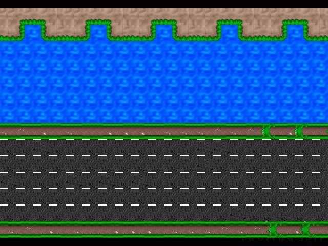

<p align="center">
  
</p>

<h1 align="center">🐸 Frogger — Python Remake</h1>

<p align="center">
  A faithful recreation of the classic <strong>1981 Konami arcade game</strong>, built from scratch in <strong>Python</strong>.<br/>
  Powered by <strong>Pygame</strong> for audio and the lightweight <strong>g2d</strong> library for rendering.
</p>

<p align="center">
  <a href="LICENSE"></a>
  
  
  
</p>

---

## 📖 About

**Frogger** is a single-player arcade game where the player guides a frog across busy roads and a treacherous river to reach safety on the opposite bank. Dodge speeding vehicles on the road, then hop onto moving logs and turtles to cross the water — fall in and you lose a life!

This project recreates the original arcade experience with:

- 🎮 **Classic gameplay** — 4 road lanes + 4 river lanes with varied obstacles and speeds.
- 🎵 **Full audio** — background music, jump effects, and distinct death sounds for drowning and getting hit.
- 🖥️ **Interactive main menu** — keyboard and mouse support, animated cursor, and a built-in controls tutorial.
- 🏆 **Scoring system** — earn 100 points per crossing; reach 500 points (5 crossings) to win.
- ❤️ **Lives system** — 3 lives with respawn mechanics and a Game Over / Victory screen.

---

## 🎮 Controls

| Key | Action |
| :-: | :----- |
| `↑` | Move up |
| `↓` | Move down |
| `←` | Move left |
| `→` | Move right |
| `R` | Restart (on Game Over / Victory screen) |
| `M` | Return to Menu (on Game Over / Victory screen) |

> The frog jumps in discrete steps of 40 px. Input is locked during the jump animation to prevent spamming.

---

## 🛠️ Installation & Setup

### Prerequisites

- **Python 3.10** or later
- **pip** (Python package manager)
- **Tkinter** — usually bundled with Python; on some Linux distros, install it separately:
  ```bash
  # Fedora
  sudo dnf install python3-tkinter
  # Debian / Ubuntu
  sudo apt install python3-tk
  ```

### Quick Start

```bash
# 1. Clone the repository
git clone https://github.com/SalvoCodes-developer/Frogger.git
cd Frogger

# 2. Install the required dependency
pip install pygame

# 3. Launch the game
python main.py
```

---

## 🏗️ Architecture & Project Structure

```
Frogger/
├── main.py                  # Entry point — game loop, state machine, obstacles, collision engine
├── src/
│   ├── Giocatore.py         # Player (frog) class — movement, animation, lives, respawn
│   └── Menu/
│       ├── __init__.py
│       └── Main_Menu.py     # Main menu — UI, buttons, cursor animation, tutorial overlay
├── lib/
│   ├── g2d.py               # 2D graphics library (Pygame/Tkinter abstraction layer)
│   └── g2d_pyodide.py       # WebAssembly/Pyodide port for browser execution
├── assets/
│   ├── images/
│   │   ├── frogger.png      # Sprite sheet (32×32 grid) — frog, vehicles, logs, turtles, UI
│   │   └── frogger-bg.png   # Background (640×480) — roads, river, grass, goal bays
│   └── audio/
│       ├── sfx_main_theme.wav   # Background music (looped)
│       ├── sfx_jump.wav         # Frog hop sound effect
│       ├── sfx_splash.wav       # Vehicle collision sound
│       └── sfx_squish.wav       # Drowning sound
├── LICENSE                  # MIT License
├── README.md
├── CONTRIBUTING.md          # Contribution guidelines
├── CODE_OF_CONDUCT.md       # Contributor Covenant v2.1
├── SECURITY.md              # Security policy
└── .gitignore
```

### State Machine

The game operates through a simple finite state machine:

```
┌───────┐  "GIOCA"  ┌────────┐  lives == 0   ┌───────────┐
│  Menu │ ────────▸ │  Game  │ ────────────▸ │ Game Over │
└───────┘           └────────┘               └───────────┘
    ▲                    │                      │  R / M
    │   M                │  score >= 500        │
    └────────────────────┤                      ▼
                         ▼                   ┌──────┐
                    ┌──────────┐     R / M   │ Menu │
                    │ Victory  │ ──────────▸ └──────┘
                    └──────────┘
```

### Core Mechanics

| Mechanic | Description |
| :--- | :--- |
| **Road collisions** | AABB intersection check between frog and vehicles → lose a life |
| **Water zone** | If the frog is in the river and not on a platform → drowning → lose a life |
| **Platform drift** | Riding a log/turtle carries the frog horizontally at the platform's speed |
| **Obstacle wrap** | Vehicles and platforms wrap seamlessly around screen edges |
| **Forgiving hitbox** | The frog's collision box is inset by 4 px on each side (24×24 vs 32×32) |
| **Jump lock** | Movement input is blocked for 6 frames during the leap animation |

---

## ⚙️ Tech Stack

| Component | Technology | Role |
| :--- | :--- | :--- |
| **Language** | Python 3.10+ | Core logic & game architecture |
| **Graphics** | g2d (bundled) | Canvas management, sprite rendering, input handling |
| **Audio** | Pygame | Sound effects & background music |
| **GUI Dialogs** | Tkinter (std lib) | System dialog fallbacks |

> **Note:** The `g2d` library was created by Prof. Michele Tomaiuolo (University of Parma) as an educational graphics module. A Pyodide port (`g2d_pyodide.py`) is included for potential browser deployment via WebAssembly.

---

## 📈 Roadmap

### 🎨 Animations & Visual Feedback
- [ ] **Splash Screen** — animated introduction on game launch.
- [ ] **Menu Transitions** — smooth animations on button press.
- [ ] **Smart Tutorial** — interactive controls guide shown only on the first game; automatically skipped on quick restarts after death.

### 💾 Data Persistence (Database)
- [ ] **Netflix-style Login** — graphical profile selection screen with user creation flow.
- [ ] **User Database** — automated tracking of usernames and total matches (SQLite).
- [ ] **Stats & Leaderboards** — all-time high score + daily best score system.

---

## 🤝 Contributing

Contributions are welcome! Please read [CONTRIBUTING.md](CONTRIBUTING.md) before getting started.

This project follows the [Contributor Covenant v2.1](CODE_OF_CONDUCT.md) code of conduct.

## 🔒 Security

To report a vulnerability, please follow the instructions in [SECURITY.md](SECURITY.md).

## 📄 License

This project is licensed under the **MIT License** — see [LICENSE](LICENSE) for details.

```
Copyright (c) 2026 Cipriano Salvatore
```